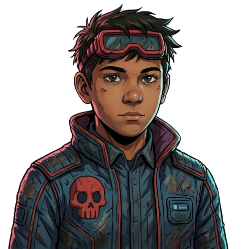

# 🚀 Full Stack Developer Portfolio | Facundo Aylan

Un portafolio web interactivo, moderno y de alto rendimiento diseñado con una estética **Glassmorphism**, efectos 3D, animación fluida y soporte completo responsive.



---

## 🛠️ Tech Stack

- **Core:** [React 18](https://react.dev/) + [Vite](https://vitejs.dev/) + [TypeScript](https://www.typescriptlang.org/)
- **Styling:** [Tailwind CSS](https://tailwindcss.com/)
- **Animations:** [Framer Motion](https://www.framer.com/motion/) + [Lucide / React Icons](https://react-icons.github.io/react-icons/)
- **Build Tooling:** Vite, ES Modules Nativos

---

## ✨ Características Principales

- **Glassmorphism UI:** Paneles con desenfoque de fondo (`backdrop-blur`), bordes sutiles con gradientes mate y diseño oscuro soberbio.
- **Tarjeta de Perfil 3D:** Efecto flip interactivo al interactuar con el componente principal.
- **Sección de Proyectos Modularizada:**
  - Selector deslizante con animación suave.
  - Previsualizador interactivo de video modal.
  - Paginador dinámico accesible desde teclado.
- **Matriz de Habilidades Adaptativa:**
  - Tarjetas compactas con indicador de nivel (*status badge*).
  - Distribución horizontal estricta en Desktop y scroll fluido habilitado en Mobile.
- **Navegación Fluida:** Transición entre secciones con escalado y opacidad optimizados.

---

## ⚙️ Instalación y Configuración Local

Sigue estos pasos para clonar e iniciar el proyecto en tu máquina local:

### 1. Clonar el repositorio

# 🚀 Instalación Rápida

```bash
# 1. Clonar el repositorio
git clone 'https://github.com/FacundoAylan/NextPortafolio.git'

# 2. Entrar al directorio
cd NextPortafolio

# 3. Instalar dependencias (elegir un gestor)
pnpm install

# 4. Iniciar servidor de desarrollo
pnpm dev
```

📬 Contacto & Redes

    LinkedIn: Facundo Aylan

    GitHub: @FacundoAylan

    Email: facundoaylan@gmail.com

    Ubicación: 📍 Buenos Aires (CABA), Argentina
